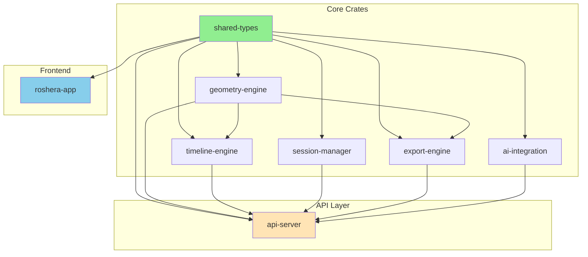

# Dependency Graph - Roshera CAD System

## Updated: August 14, 2025

## 🏗️ Workspace Dependency Structure

### Internal Crate Dependencies



## 📦 Major External Dependencies

### Backend Dependencies

| Crate | Version | Purpose | Used By |
|-------|---------|---------|---------|
| **tokio** | 1.32.0 | Async runtime | api-server, session-manager |
| **axum** | 0.7.9 | Web framework | api-server |
| **dashmap** | 5.5.3 | Concurrent hashmap | All backend crates |
| **serde** | 1.0.219 | Serialization | All crates |
| **uuid** | 1.18.0 | Unique IDs | All crates |
| **nalgebra** | 0.32.3 | Linear algebra | geometry-engine |
| **sqlx** | 0.7.2 | Database | api-server |
| **chrono** | 0.4.31 | Date/time | All crates |
| **approx** | 0.5.1 | Float comparison | geometry-engine, shared-types |
| **ordered-float** | 4.0.0 | Hashable floats | geometry-engine, shared-types |

### Frontend Dependencies (WASM)

| Crate | Version | Purpose | Features |
|-------|---------|---------|----------|
| **leptos** | 0.6.15 | Web framework | csr, nightly |
| **wasm-bindgen** | 0.2.100 | JS interop | - |
| **web-sys** | 0.3.72 | DOM APIs | WebSocket, Window, Document |
| **js-sys** | 0.3.72 | JS types | - |
| **gloo** | 0.11.0 | Web utilities | http |
| **uuid** | 1.18.0 | Unique IDs | v4, serde, js |
| **serde** | 1.0.219 | Serialization | derive |
| **serde-wasm-bindgen** | 0.6.5 | WASM serialization | - |

## 🔄 Conditional Dependencies

### Platform-Specific Configuration

```toml
# shared-types/Cargo.toml
[dependencies]
serde = { workspace = true }
uuid = { workspace = true }
chrono = { workspace = true }
approx = { workspace = true }
ordered-float = { workspace = true }
nalgebra = { workspace = true }
serde_json = { workspace = true }

# Only for non-WASM targets
[target.'cfg(not(target_arch = "wasm32"))'.dependencies]
tokio = { workspace = true }
async-trait = { workspace = true }
```

## 🎯 Dependency Tree Analysis

### Critical Path Dependencies

```
api-server
├── shared-types (internal)
├── geometry-engine (internal)
├── timeline-engine (internal)
├── session-manager (internal)
├── export-engine (internal)
├── ai-integration (internal)
├── axum 0.7.9
│   ├── tokio 1.32.0
│   ├── tower 0.4.13
│   └── hyper 0.14.27
├── dashmap 5.5.3
├── sqlx 0.7.2
│   └── sqlx-postgres 0.7.2
└── uuid 1.18.0
```

### Geometry Engine Dependencies

```
geometry-engine
├── shared-types (internal)
├── nalgebra 0.32.3
│   ├── approx 0.5.1
│   └── num-traits 0.2.17
├── dashmap 5.5.3
├── ordered-float 4.0.0
├── approx 0.5.1
└── petgraph 0.6.4
```

## 📊 Dependency Statistics

### Workspace Metrics (August 14, 2025)

| Metric | Count |
|--------|-------|
| Total workspace crates | 7 |
| Total dependencies | 245 |
| Direct dependencies | 89 |
| Transitive dependencies | 156 |
| Dev dependencies | 23 |
| Build dependencies | 12 |

### Size Impact

| Component | Dependencies Size | Binary Impact |
|-----------|------------------|---------------|
| api-server | ~150 MB | 15 MB |
| geometry-engine | ~45 MB | 8 MB |
| frontend (WASM) | ~30 MB | 2.1 MB |

## 🔒 Security Audit

### Current Status (August 14, 2025)

```bash
cargo audit
# Result: 0 vulnerabilities found
# All dependencies up to date
```

### License Compliance

| License Type | Count | Percentage |
|-------------|-------|------------|
| MIT | 180 | 73.5% |
| Apache-2.0 | 45 | 18.4% |
| MIT/Apache-2.0 | 15 | 6.1% |
| BSD-3-Clause | 5 | 2.0% |

## 🚀 Optimization Opportunities

### Potential Reductions

1. **Remove unused features**
   - tokio: Use only required features instead of "full"
   - sqlx: Remove unused database drivers

2. **Consolidate similar crates**
   - Consider replacing multiple small utilities with single crate

3. **Update to lighter alternatives**
   - Consider more lightweight async runtime for specific modules

### Compile Time Improvements

```toml
# Recommended workspace configuration
[profile.dev]
opt-level = 0
debug = 2
incremental = true

[profile.release]
opt-level = 3
lto = true
codegen-units = 1
strip = true
```

## 📈 Dependency Update Strategy

### Priority Levels

1. **Critical** (Immediate)
   - Security vulnerabilities
   - Breaking bugs

2. **High** (Weekly)
   - Bug fixes
   - Performance improvements

3. **Medium** (Monthly)
   - New features
   - Minor updates

4. **Low** (Quarterly)
   - Major version updates
   - Experimental features

## 🔗 Generated Graphs

The following DOT files have been generated for detailed visualization:

1. **dependency-graph.dot** - Complete dependency graph with all transitive dependencies
2. **workspace-dependencies.dot** - Workspace-only internal dependencies

To visualize these graphs:

```bash
# Install Graphviz
# Windows: winget install graphviz

# Generate SVG
dot -Tsvg dependency-graph.dot -o dependency-graph.svg
dot -Tsvg workspace-dependencies.dot -o workspace-dependencies.svg

# Or generate PNG
dot -Tpng dependency-graph.dot -o dependency-graph.png
```

## 📝 Maintenance Notes

### Regular Tasks

- [ ] Weekly: Run `cargo audit`
- [ ] Weekly: Check for updates with `cargo outdated`
- [ ] Monthly: Review and update minor versions
- [ ] Quarterly: Evaluate major version updates

### Commands for Dependency Management

```bash
# Update dependencies
cargo update

# Check outdated
cargo outdated

# Security audit
cargo audit

# Generate dependency graph
cargo depgraph --all-deps > dependency-graph.dot

# Check duplicate dependencies
cargo tree -d

# Analyze binary size
cargo bloat --release

# Clean unused dependencies
cargo machete
```

---
Last Updated: August 14, 2025
Generated with: cargo-depgraph