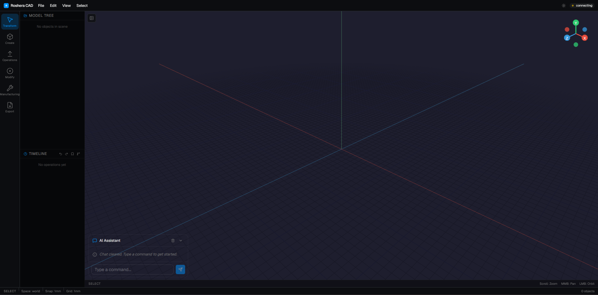
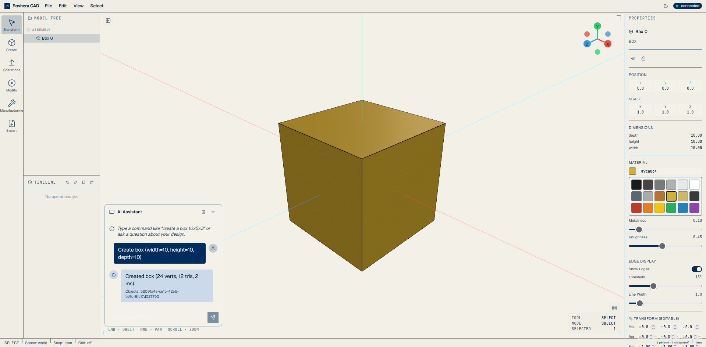
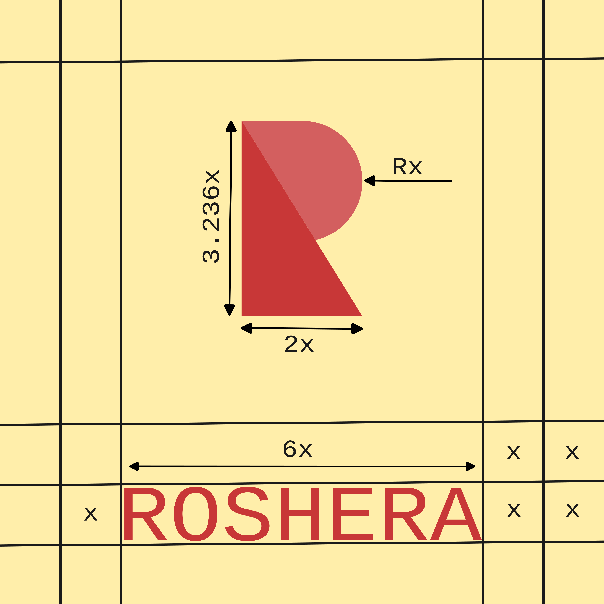

<p align="center">
  
</p>

<h1 align="center">Roshera</h1>

<p align="center">
  <strong>AI-native CAD engine — B-Rep geometry kernel built from scratch in Rust.</strong>
</p>

<p align="center">
  <a href="#what-works-today"></a>
  <a href="#what-works-today"></a>
  <a href="#what-works-today"></a>
  <a href="#what-works-today"></a>
  <a href="#performance"></a>
  <a href="LICENSE"></a>
</p>

---

Roshera is a boundary representation CAD system with an LLM-driven design workflow, production-grade NURBS mathematics, and a vision-aware AI pipeline that sees your viewport. No wrappers around OpenCASCADE or Parasolid — every line of the geometry kernel is original.

| Dark Mode | Light Mode |
|-----------|------------|
|  |  |

## Architecture

```
roshera-backend/
  geometry-engine/     B-Rep kernel: NURBS math, primitives, topology, operations, tessellation
  ai-integration/      LLM providers (Claude, OpenAI) + vision pipeline + smart routing
  timeline-engine/     Event-sourced design history with branching
  session-manager/     Multi-user collaboration with RBAC
  export-engine/       STL, OBJ, encrypted .ros (AES-256-GCM), STEP (in progress)
  rag-engine/          Vamana-indexed retrieval for design knowledge
  api-server/          Axum REST + WebSocket API
  shared-types/        Common type definitions

roshera-app/           React + Three.js + TypeScript browser client
```

## Status

Measured numbers for each subsystem below are in the [Performance](#performance) section.

| Layer | Component | Status |
|-------|-----------|--------|
| **Math** | Vector3, Matrix4, Quaternion | Tested, SIMD-optimized |
| | B-spline, NURBS evaluation | Tested, hardened against singularities; perf above budget (see Performance) |
| **Primitives** | Box, Sphere, Cylinder, Cone, Torus | B-Rep topology with Euler validation |
| **Topology** | Manifold detection, adjacency | Tested |
| **Tessellation** | Per-surface dispatch, adaptive subdivision | Tested for analytic surfaces; perf above budget (see Performance) |
| **Operations** | Extrude (draft, taper, twist) | Tested |
| | Boolean (union, intersect, difference) | Implemented, edge cases in progress |
| | Fillet (constant-radius) | Implemented |
| | Chamfer, Offset, Sewing | Implemented |
| | Revolve (full/partial) | Implemented |
| | Sweep (single path) | Implemented, multi-guide not started |
| | Loft (ruled surfaces) | Implemented, smooth NURBS loft not started |
| **Sketch 2D** | Newton-Raphson constraint solver | Implemented |
| **Assembly** | Data model + mates | Defined; constraint solver not started |
| **Export** | STL, OBJ, encrypted .ros | Working |
| | STEP | Bridge implemented, output validation needed |
| **AI** | Claude + OpenAI providers | Working |
| | Vision pipeline + smart routing | Implemented |
| | Natural language command parsing | Working |
| **Infrastructure** | Timeline (event-sourced history) | Working |
| | RAG (Vamana vector index) | Working |
| | Session manager (multi-user, RBAC) | Working |
| **Frontend** | React + R3F viewport, toolbar, chat | Working |

## Performance

Measured numbers from the geometry kernel. See individual sections below for detail and methodology. Full table and reproduction commands in [BENCHMARKS.md](BENCHMARKS.md).

### Math microbenchmarks

Criterion, release build, median of 100 samples.

| Operation | Time |
|-----------|------|
| Vector3 dot | 500 ps |
| Vector3 cross | 884 ps |
| Vector3 normalize | 1.68 ns |
| Vector3 add | 984 ps |
| Matrix4 multiply | 5.14 ns |
| Matrix4 inverse | 29.4 ns |
| Matrix4 transpose | 5.50 ns |
| Point3 distance | 505 ps |
| Point3 translate | 868 ps |

### Primitive creation

Full B-Rep topology construction with a fresh `BRepModel` per iteration. Criterion, release build.

| Primitive | Time |
|-----------|------|
| Box | 65 µs |
| Sphere | 49 µs |
| Cylinder | 50 µs |

### Boolean and intersection

Internal benchmark suite on 1k-face inputs, release build.

| Operation | Measured | Internal target |
|-----------|----------|-----------------|
| Boolean union | 50.5 ms | <100 ms |
| Boolean intersection | 75.4 ms | <150 ms |
| Face–face intersection | 25.3 ms | <50 ms |

All three are comfortably under their internal regression budgets.

### NURBS and B-spline evaluation

1M-point sweep, release build.

| Operation | Measured | Internal target |
|-----------|----------|-----------------|
| NURBS surface eval | 158 ms | <25 ms |
| B-spline curve eval | 36.8 ms | <10 ms |

Both are above their internal regression budgets — NURBS eval by ~6× and B-spline eval by ~3.7×. Flagged for profiling and optimization.

### Tessellation and memory

| Metric | Measured | Internal target |
|--------|----------|-----------------|
| Tessellation (1M triangles, estimated) | 5,350 ms | <250 ms |
| Memory per 1M vertices (SoA layout) | 34.3 MB | <192 MB |

Memory is well under budget thanks to the structure-of-arrays vertex layout. Tessellation is the single biggest performance gap (~21× over target) and is the top candidate for the next optimization pass.

### Coverage gaps

- **Delete primitives** — only correctness tests (`delete_solid`, `delete_face`, cascade, orphan cleanup). No Criterion target yet.
- **2D sketch creation (sketch2d)** — ~5k LoC subsystem with 69 passing correctness tests, but no timing benchmark target.
- **Cone / Torus** — primitive creation benchmarks only cover Box / Sphere / Cylinder.

These are tracked as blind spots to add to `benches/geometry_bench.rs`.

### Methodology

- Host: Windows 11, x86_64, release build.
- Profile overrides: `CARGO_PROFILE_BENCH_LTO=off`, `CARGO_PROFILE_BENCH_CODEGEN_UNITS=16`. Full-LTO would shave an additional 15–30% off these numbers but currently hits a rustc-LLVM OOM on this host — fix tracked separately.
- Criterion numbers reported as the median of 100 samples after a 3-second warmup.
- Internal-suite numbers (Boolean / NURBS / tessellation) are single-sample wall-clock with per-operation iteration counts in the 10–100 range. Treat Criterion numbers as the statistical baseline.
- "Internal target" = internal regression budget. Not a comparison against any third-party kernel.

Reproduce:

```bash
cd roshera-backend
CARGO_PROFILE_BENCH_LTO=off CARGO_PROFILE_BENCH_CODEGEN_UNITS=16 \
  cargo bench -p geometry-engine --bench geometry_bench

CARGO_PROFILE_RELEASE_LTO=off CARGO_PROFILE_RELEASE_CODEGEN_UNITS=16 \
  cargo test --release -p geometry-engine --lib test_performance_benchmark_suite -- --nocapture
```

## Getting Started

```bash
# Backend
cd roshera-backend
cargo run --bin api-server
# API on http://localhost:3000, WebSocket on ws://localhost:3000/ws

# Frontend (separate terminal)
cd roshera-app
npm install
npm run dev
# UI on http://localhost:5173
```

### Docker

```bash
cd roshera-backend
docker compose up
```

### Prerequisites

- Rust 1.75+
- Node.js 20+

## API

```bash
# Create a box
curl -X POST http://localhost:3000/api/geometry \
  -H "Content-Type: application/json" \
  -d '{"operation": "create_primitive", "parameters": {"type": "box", "width": 10, "height": 10, "depth": 10}}'
```

```javascript
// WebSocket
const ws = new WebSocket("ws://localhost:3000/ws");
ws.send(JSON.stringify({
  type: "GeometryCommand",
  data: { command: "CreatePrimitive", parameters: { type: "sphere", radius: 5.0 } }
}));
```

## Logo

<p align="center">
  
</p>

The Roshera mark is constructed from a Boolean union of a rectangle (2x × 3.236x) and a circle (radius x), expressing the core operation of the geometry kernel itself.

## License

Dual licensed. Free for non-commercial use (research, education, personal projects). Commercial use requires a paid license.

See [LICENSE](LICENSE) for details. Contact 29.varuns@gmail.com for commercial licensing.
