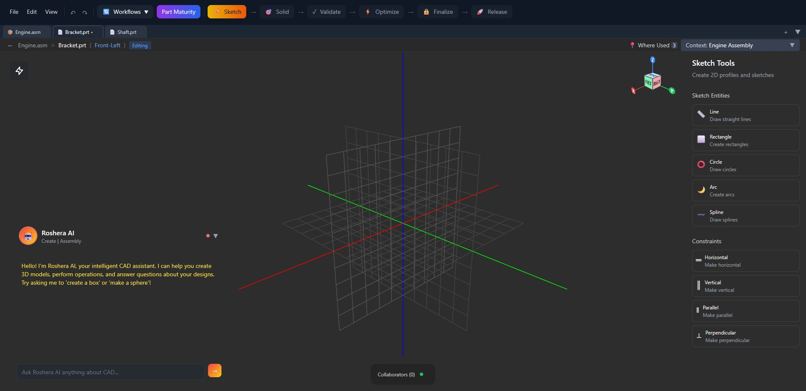

# Roshera

**B-Rep geometry kernel built from scratch in Rust.**

Roshera is a boundary representation CAD system with production-grade mathematical foundations — NURBS curves and surfaces, exact B-Rep topology, and real-time tessellation. No wrappers around OpenCASCADE or Parasolid.

Primitives, topology, and NURBS math are production-ready. Operations (booleans, fillet, chamfer) and AI integration are under active development.



## Architecture

```
roshera-backend/
  geometry-engine/     B-Rep kernel: math, primitives, topology, operations, tessellation
  ai-integration/      API-based AI providers (Claude, OpenAI)
  timeline-engine/     Event-sourced design history with branching
  session-manager/     Multi-user collaboration with RBAC
  export-engine/       STL, OBJ, ROS export
  rag-engine/          Vamana-indexed retrieval for design knowledge
  api-server/          Axum REST + WebSocket API
  shared-types/        Common type definitions

roshera-front/         Leptos/WASM + Three.js browser client
```

## What Works Today

| Component | Status | Notes |
|-----------|--------|-------|
| **Math** | Production | Vector3, Matrix4, Quaternion, B-spline, NURBS — tested, SIMD-optimized |
| **Primitives** | Production | Box, Sphere, Cylinder, Cone, Torus — real B-Rep topology |
| **Topology** | Production | Euler validation, manifold detection, adjacency queries, parallel building |
| **Tessellation** | Production | Per-surface-type dispatch, adaptive subdivision, visualization meshes |
| **Extrude** | Working | Face and profile extrusion with draft angle support |
| **Boolean** | Partial | Surface-surface intersection computed; face reconstruction in progress |
| **Fillet** | Partial | Constant-radius working; variable-radius in development |
| **Revolve / Sweep / Loft** | In development | Pipeline structured, surface generation incomplete |
| **Chamfer** | In development | Entry point exists, adjacent face lookup incomplete |
| **Assembly** | Data model | Components, mates, motion limits defined; constraint solver not implemented |
| **2D Sketch** | Partial | Newton-Raphson solver loop working; constraint coverage expanding |
| **Export** | STL + OBJ + ROS | STEP writer structured but output not yet valid |
| **RAG Engine** | Working | Vamana/DiskANN vector index with cosine/euclidean/dot-product |
| **Timeline** | Working | Event-sourced history with branching |
| **AI Integration** | Working | Claude + OpenAI API providers, natural language command parsing |

## Getting Started

```bash
# Backend
cd roshera-backend
cargo run --bin api-server
# API on http://localhost:3000, WebSocket on ws://localhost:3000/ws

# Frontend (separate terminal)
cd roshera-front
trunk serve
# UI on http://localhost:8080
```

### Docker

```bash
cd roshera-backend
docker compose up
```

### Prerequisites

- Rust 1.75+
- trunk (for frontend): `cargo install trunk`
- wasm32-unknown-unknown target: `rustup target add wasm32-unknown-unknown`

## API

```bash
# Create a box
curl -X POST http://localhost:3000/api/geometry \
  -H "Content-Type: application/json" \
  -d '{"operation": "create_primitive", "parameters": {"type": "box", "width": 10, "height": 10, "depth": 10}}'
```

```javascript
// WebSocket
const ws = new WebSocket("ws://localhost:3000/ws");
ws.send(JSON.stringify({
  type: "GeometryCommand",
  data: { command: "CreatePrimitive", parameters: { type: "sphere", radius: 5.0 } }
}));
```

## License

Dual licensed. Free for non-commercial use (research, education, personal projects). Commercial use requires a paid license.

See [LICENSE](LICENSE) for details. Contact 29.varuns@gmail.com for commercial licensing.
